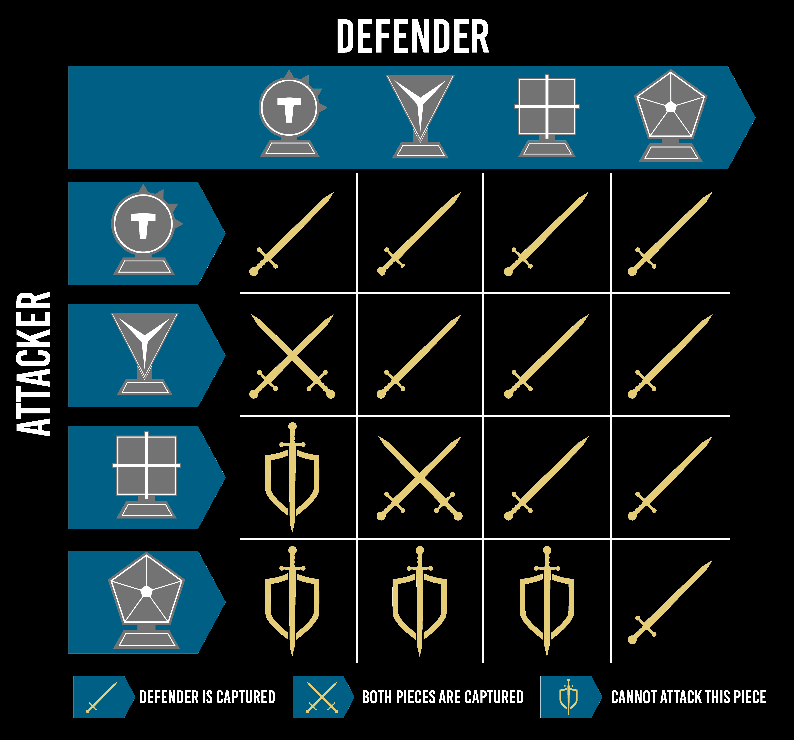

# Functional and Logic Programming - 1st Pratical Assignment
## Game Theme
**[Tactigon Board Game](https://tactigongame.com/)**
## Group Description
Group Name: **Tactigon_4**

Group Members:
- **[Marco André Pereira da Costa](https://github.com/SpardaMarco)** - up202108821 - 50% contribution
- **[Tiago Filipe Castro Viana](https://github.com/tiagofcviana)** - up201807126 - 50% contribution

## Installation and Execution
In order to install and execute the game, you must download ***PFL_TP1_T03_Tactigon_4.ZIP*** and extract it. Then, inside the *src* directory, consult the ***main.pl*** file through SICStus Prolog 4.8. Finally, run the following command:
```prolog
?- play.
```
To improve the game experience, we recommend maximizing the SICStus Prolog window and changing the font as follows:
- Font: Consolas
- Style: Normal
- Size: 11

The game is available for Windows and Linux.

## Game Description

**Tactigon** is a board game for two players, played on an irregular hexagon board. Each player starts with 13 pieces. The game starts with a default board configuration, and the players take turns moving their pieces and resolving any combat that may result from that movement.

General movement rules:
- Pieces can move along any path and in any direction up to their maximum spaces.
- Pieces can't jump over other pieces.*
- Maximum spaces are equal to the number of sides of the piece.**

\* - This rule can be changed by applying the advanced rule 1.<br>
** - This rule can be changed by applying the advanced rule 2.

Pieces can be one of this four types:
- **Circle** - 1 side
- **Triangle** - 3 sides
- **Square** - 4 sides
- **Pentagon** - 5 sides



Figure 1 - Combat Table

The pieces can combat the opponent's pieces by moving to a tile occupied by an opposing piece.

Combat has two outcomes:
- The defending piece is captured, marked by a sword icon in Figure 1.
- Both pieces are captured, marked by a two swords crossing icon in Figure 1.

The sword and shield icon represents certain combats that can't occur in the game.<br>
Captured pieces are removed from the board and can't be used for the rest of the game.

The victory can be achieved by **capturing the opponent's pentagon** or by occupying **both gold tiles** at the **end** of the **opponent's turn**.

Two optional advanced rules can be applied to the game:
1. *Square pieces can jump over other pieces, except for opposing squares. A "jumped" tile still counts towards the piece's move limit.*
2. *Pieces that start a turn on a gold tile can move an additional space on that turn.*

For more information about the game, please consult the [official website](https://tactigongame.com/).<br>
For more information about the game rules, please consult the [How to Play](https://tactigongame.com/how-to-play/) or the [Rulebook](https://online.fliphtml5.com/hvuax/bvzo/).

## Game Logic

### Internal Game State Representation

**Board -** The board is represented by a list of *Positions*. Each *Position* is represented by 2 elements: a *Piece* and the *Tile* where the *Piece* is located. Each *Tile* consists of the coordinates (X, Y) on the board. The minimum and maximum values for the X coordinate is defined for each line, and there can only be tiles inside those limits. Finally, the board also has *Gold Tiles*, which are represented by the corresponding (X, Y) coordinates on the board with the predicate **gold_tile/2**.

**Player -** The game has only two players, cian and red, represented by the corresponding atoms. The first player to move is chosen randomly, and after each turn, the current player is changed to the other player using the **other_player/2** predicate.

The **GameState** is represented by a list with the **Board** and the current **Player** at a given time in the game. The **GameState** does not contain a list of pieces that each player has captured, since they are removed from the board and can't be used for the rest of the game.

This is the representation of the board in the **initial** game state, where each piece is located in its starting position:
```prolog
% board(+State, -Board)
% Unifies Board with the board at the current State for starting a game or for demonstrating different board states
board(initial, 
[
    position(cian-circle-1, tile(3, 0)),
    position(cian-circle-2, tile(1, 1)),
    position(cian-square-1, tile(2, 1)),
    position(cian-triangle-1, tile(3, 1)),
    position(cian-square-2, tile(4, 1)),
    position(cian-circle-3, tile(5, 1)),
    position(cian-triangle-2, tile(2, 2)),
    position(cian-pentagon-1, tile(3, 2)),
    position(cian-triangle-3, tile(4, 2)),
    position(cian-circle-4, tile(1, 3)),
    position(cian-square-3, tile(3, 3)),
    position(cian-circle-5, tile(5, 3)),
    position(cian-circle-6, tile(3, 4)),
    position(red-circle-1, tile(3, 6)),
    position(red-circle-2, tile(1, 7)),
    position(red-triangle-1, tile(2, 7)),
    position(red-square-1, tile(3, 7)),
    position(red-triangle-2, tile(4, 7)),
    position(red-circle-3, tile(5, 7)),
    position(red-square-2, tile(2, 8)),
    position(red-pentagon-1, tile(3, 8)),
    position(red-square-3, tile(4, 8)),
    position(red-circle-4, tile(1, 9)),
    position(red-triangle-3, tile(3, 9)),
    position(red-circle-5, tile(5, 9)),
    position(red-circle-6, tile(3, 10))
]
).
```
*board.pl*

This is a possible representation of the board in an **intermediate** game state. The pieces are located in different positions than the initial game state, some of the pieces were captured, but no player has won yet, since both players still have their pentagon and the gold tiles [(1,5) and (5,1)] are not both occupied by the same player:

```prolog
% board(+State, -Board)
% Unifies Board with the board at the current State for starting a game or for demonstrating different board states
board(intermediate, 
[
    position(cian-circle-1, tile(4, 5)),
    position(cian-square-1, tile(5, 7)),
    position(cian-triangle-1, tile(5,2)),
    position(cian-circle-3, tile(5, 1)),
    position(cian-pentagon-1, tile(3, 0)),
    position(cian-triangle-3, tile(0, 5)),
    position(cian-circle-6, tile(5, 5)),
    position(red-circle-1, tile(3, 2)),
    position(red-square-1, tile(5, 6)),
    position(red-pentagon-1, tile(3, 5)),
    position(red-circle-4, tile(2, 3)),
    position(red-triangle-1, tile(3, 9)),
    position(red-circle-6, tile(1, 5))
]
).
```
*board.pl*

And finally, a possible representation of the board in the **final** game state, where the cian player has won the game by capturing the red player's pentagon:
```prolog
% board(+State, -Board)
% Unifies Board with the board at the current State for starting a game or for demonstrating different board states
board(final, 
[
    position(cian-circle-1, tile(5, 1)),
    position(cian-pentagon-1, tile(5, 6)),
    position(red-circle-1, tile(3, 5))
]
).
```
*board.pl*

### Game State Visualization
In the main menu, the user can choose to start a new game, change settings or exit the game. 
```prolog
% menu/0
% Displays the menu and processes the user input. 1 to start the game, 2 to change settings and 3 to exit
menu :-
    display_menu,
    get_option(1, 3, 'Select an option', 'option', Option),
    processMenuOption(Option).

% processMenuOption(+Option)
% Processes the user input
processMenuOption(1) :-
    board_size(_, Size),
    initial_state(Size, [Board, Player]),
    game_loop([Board, Player]),
    !.

processMenuOption(2) :-
    change_settings,
    !,
    menu.

processMenuOption(3) :-
    clear_screen,
    !.
```
The input is validated using the **get_option/5** predicate, which asks the user for an option between two values and reads the input. If the input is valid, the predicate returns the input. If not, the predicate asks the user for a new input. The request and the error messages are defined by the *Objective* and *Error* elements, respectively:
```prolog
% get_option(+MinValue, +MaxValue, +Objective, +Error, -Option)
% Given an objective, unifies Option with the value given by user input between Min and Max
get_option(MinValue, MaxValue, Objective, _, Option):-
    format('~a between ~d and ~d: ', [Objective, MinValue, MaxValue]),
    read_number_input(Option),
    between(MinValue, MaxValue, Option), 
    !.

get_option(MinValue, MaxValue, Objective, Error, Option):-
    format('Invalid ~a.~n', [Error]),
    get_option(MinValue, MaxValue, Objective, Error, Option).
```

If the user chooses to start a new game, the game will start with the defined settings. The predicate **initial_state/2** is responsible for creating the initial game state, based on the board size given.
```prolog
% initial_state(+Size, -GameState)
% Returns the initial game state for a given board size
initial_state(Size, [Board, Player]) :-
    board_size(_, Size),
    !,
    board(initial, Board),
    findall(P, player(P), Players),
    random_member(Player, Players).

initial_state(Size, [Board, Player]) :-
    create_new_board(Size),
    !,
    board(initial, Board),
    findall(P, player(P), Players),
    random_member(Player, Players).
```
*logic.pl*

This predicate verifies if the board size is the current board size defined in the settings. If so, the initial game state is created using the initial board. If not, a new board is created using the **create_new_board/1** predicate and the initial game state is created using the new board. E.G.:

```prolog
% create_new_board(+Size)
% Creates a new board with Size lines, with a default number of columns for that size
create_new_board(11) :-
    clear_board,
    assert(board_size(7, 11)),
    assert_list([
        line(0, 2, 4),
        line(1, 1, 5),
        line(2, 1, 5),
        line(3, 1, 5),
        line(4, 0, 6),
        line(5, 0, 6),
        line(6, 1, 5),
        line(7, 1, 5),	
        line(8, 1, 5),
        line(9, 1, 5),
        line(10, 3, 3)
    ]),
    assert_list([
        gold_tile(1, 5),
        gold_tile(5, 5)
    ]),
    assert(board(initial, 
    [
        ...
    ])),
    assert(board(intermediate, 
    [
        ...
    ])),
    assert(board(final, 
    [
        ...
    ])).
```
*board.pl*

During the game, the move input is validated using the **ask_move/2** predicate, which asks the user for a two pairs of coordinates and reads the input. Each pair of coordinates is validated using ... 
```prolog


If the user chooses to change settings, the user is asked to select:
1. Board Size (11 lines, 7 columns; 13 lines, 9 columns; 15 lines, 11 columns);
2. Cian Difficulty (Bot (Random), Bot (Greedy), Human);
3. Red Difficulty (Bot (Random), Bot (Greedy), Human);
4. Advanced Rules (Advanced Rule 1, Advanced Rule 2, Both Advanced Rules, None).

```terminal
Select an option between 1 and 3: 2
Board Size:
1 - 11 lines, 7 columns (Default board size)
2 - 13 lines, 9 columns
3 - 15 lines, 11 columns
Select an option between 1 and 3: 1         <--- 1.
Player cian is:
1 - Level 1 Bot (Random)
2 - Level 2 Bot (Greedy)
3 - Human
Select an option between 1 and 3: 3         <--- 2.
Player red is:
1 - Level 1 Bot (Random)
2 - Level 2 Bot (Greedy)
3 - Human
Select an option between 1 and 3: 3         <--- 3.
Advanced Rules:
1 - Square pieces can jump over other pieces, except for opposing squares. A "jumped" tile still counts towards the piece's move limit.
2 - Pieces that start a turn on a gold tile can move an additional space on that turn.
Options:
1 - Advanced Rule 1
2 - Advanced Rule 2
3 - Both Advanced Rules
4 - None
Select an option between 1 and 4: 4         <--- 4.
```

### Move Validation and Execution

The game runs in a loop where each iteration corresponds to a turn. The only stop condition of this loop is the victory of one of the players:
```prolog
% game_loop(+GameState)
% Main game loop
game_loop(GameState) :-
    game_over(GameState, Winner),
    !,
    display_game(GameState),
    display_winner(Winner),
    !,
    menu.

game_loop(GameState) :-
    display_game(GameState),
    process_turn(GameState, NewGameState),
    !,
    game_loop(NewGameState).
```
*main.pl*

The **process_turn/2** predicate is responsible for processing the turn of the current player. If the current player is human, this predicate will ask for a move, validate the input and call the predicate **move/3**, if the input is valid. If the chosen move is not valid, the **invalid_move/0** predicate prints a warning message in the terminal and the user is asked to choose another move (this is repeated until the chosen move is valid). If the current player is a bot, this predicate will choose a valid move (depending on the difficulty level) and make the move:
```prolog
% process_turn(+GameState, -NewGameState)
% Processes the turn of the current player
process_turn([Board, Player], [NewBoard, NewPlayer]) :-
    difficulty(Player, 3), % Human player
    !,
    repeat,
    invalid_move, % Display an invalid move message if the move is invalid
    get_move([Board, Player], OX-OY-DX-DY), % Get a move from the user
    move([Board, Player], OX-OY-DX-DY, [NewBoard, NewPlayer]),
    !.

process_turn([Board, Player], [NewBoard, NewPlayer]) :-
    difficulty(Player, Difficulty), % Computer player
    !,
    choose_move([Board, Player], Player, Difficulty, OX-OY-DX-DY), % Get a move from the computer
    move_aux([Board, Player], OX-OY-DX-DY, [NewBoard, NewPlayer]),
    !.
```
*main.pl*

The **get_move/2** predicate is responsible for asking the user for a move and reading the input.

The **move/3** predicate is responsible for validating the move, executing the move if it is valid, and returning the new game state. This predicate starts by validating the move using the **validate_move/2** predicate. If the move is valid, the predicate **move_aux/3** is called to execute the move:
```prolog
% move(+GameState, +Move, -NewGameState)
% Validates a move, makes the move when valid and returns the new game state
move([Board, Player], OX-OY-DX-DY, [NewBoard, NewPlayer]) :-
    validate_move([Board, Player], OX-OY-DX-DY), % Check if the move is valid
    move_aux([Board, Player], OX-OY-DX-DY, [NewBoard, NewPlayer]).
```
*logic.pl*

The **validate_move/2** predicate is responsible for validating the move. It starts by checking if the chosen piece is, in fact, on the board and if it belongs to the current player:
```prolog
% validate_move(+GameState, +Move)
% Checks if a move is valid
validate_move([Board, Player], OX-OY-DX-DY) :-
    member(position(Piece, tile(OX, OY)), Board), % Check if the piece exists in the board
    piece_info(Piece, Player, _), % Check if the piece belongs to the player
    valid_move_for_piece([Board, Player], Piece, OX-OY-DX-DY).
``` 
*logic.pl*

After that, the predicate **valid_move_for_piece/3** is called to check if the move is valid for the chosen piece. 

If the **advanced rule 2** is applied, the predicate **valid_move_for_piece/3** will check if the chosen piece is on a gold tile, in order to determine if the piece can move an additional space:
```prolog
% valid_move_for_piece(+GameState, +Piece, +Move)
% Checks if a move is valid for a particular piece
valid_move_for_piece([Board, Player], Piece, OX-OY-DX-DY) :-
    rules(2),
    gold_tile(OX, OY),
    piece_info(Piece, _, Type),
    movement(Type, N),  % N is the maximum number of steps for this type of piece
    N1 is N + 1, % N1 is the maximum number of steps increases by 1 because of additional rule 2 when piece is on a gold tile
    valid_move_dfs([Board, Player], N1, Piece, OX-OY-DX-DY, OX-OY).
```
*logic.pl*

If the **advanced rule 2** is not applied, this predicate starts by checking the type of the chosen piece, in order to determine the maximum number of spaces that the piece can move:
```prolog
valid_move_for_piece([Board, Player], Piece, OX-OY-DX-DY) :-
    piece_info(Piece, _, Type), % Get the type of the piece
    movement(Type, N),  % N is the maximum number of steps for this type of piece
    valid_move_dfs([Board, Player], N, Piece, DX-DY, OX-OY).
```
*logic.pl*

After determining the maximum number of spaces that the piece can move, the predicate **valid_move_dfs/5** is called to check if the move is valid for the chosen piece. This predicate uses a depth-first search algorithm to check if the move is valid. The depth-first search algorithm starts by checking if the chosen piece can move to the destination tile in a single step. If it can, there are two possible outcomes: the destination tile is empty or the destination tile is occupied by an opposing piece. If the destination tile is empty, the move is valid. If the destination tile is occupied by an opposing piece, the move is valid if the combat is possible (i.e., the current player's piece can capture the opposing piece or the combat ends in a draw where both pieces are captured):
```prolog
% valid_move_dfs(+GameState, +N, +Piece, +DestinationTile, +CurrentTile)
% Checks if a move is valid for a particular piece using DFS, being N the number of steps left to take
valid_move_dfs([Board, _], N, _, DX-DY, CX-CY) :-
    N > 0,
    adjacent(tile(CX, CY), tile(DX, DY)), % Check if the destination tile is adjacent to the current tile
    \+ member(position(_, tile(DX, DY)), Board). % Check if the destination tile is empty

valid_move_dfs([Board, Player], N, Piece, DX-DY, CX-CY) :-
    N > 0,
    adjacent(tile(CX, CY), tile(DX, DY)), % Check if the destination tile is adjacent to the current tile
    member(position(Defender, tile(DX, DY)), Board),
    other_player(Player, DefenderPlayer), 
    piece_info(Defender, DefenderPlayer, DefenderType),  % Check if the destination tile is occupied by an opponent's piece
    piece_info(Piece, Player, Type),
    combat(Type, DefenderType, _). % Check if the piece can attack the opponent's piece
```
*logic.pl*

If the chosen piece can't move to the destination tile in a single step, the depth-first search algorithm will move to an adjacent tile of the current piece and call itself recursively, decreasing the number of steps left to take by 1. This process will continue until the maximum number of spaces that the piece can move is reached (when N is equal to 0) and all possible moves are checked, in depth. Within the recursive calls, if there are still moves left to take, the algorithm will check if the destination tile is adjacent to the current tile and if it is empty or occupied by an opposing piece. If the destination tile is empty, the move is valid. If the destination tile is occupied by an opposing piece and the combat is possible, the move is valid. If there are no more moves left to take, the move is invalid. 

If the **advanced rule 1** is applied, the predicate **valid_move_dfs/5** will also check if the chosen piece is a square, in order to determine if the piece can jump over other pieces (except for opposing squares):
```prolog
% Special case for the square piece when advanced rule 1 is enabled.
% Square pieces can jump over other pieces, except for opposing squares. 
% A "jumped" tile still counts as a step.
valid_move_dfs([Board, Player], N, Player-square-Id, DX-DY, CX-CY) :-
    rules(1),
    N > 0,
    N1 is N - 1,
    other_player(Player, Opponent), % Get the opponent of the player
    findall(X-Y, adjacent(tile(CX, CY), tile(X, Y)), AdjacentTiles),  % Get all the adjacent tiles to the current tile
    member(CX1-CY1, AdjacentTiles), % Get an adjacent tile
    \+ member(position(Opponent-square-_, tile(CX1, CY1)), Board), % Check if the adjacent tile is not occupied by an opponent's square
    valid_move_dfs([Board, Player], N1, Player-square-Id, DX-DY, CX1-CY1).
```
*logic.pl*

By default, pieces can't jump other pieces. Therefore, if the **advanced rule 1** is not applied, the algorithm will only make the recursive call if the chosen adjacent tile is empty:
```prolog
valid_move_dfs([Board, Player], N, Piece, DX-DY, CX-CY) :-
    N > 0,
    N1 is N - 1,
    findall(X-Y, adjacent(tile(CX, CY), tile(X, Y)), AdjacentTiles), % Get all the adjacent tiles to the current tile
    member(CX1-CY1, AdjacentTiles), % Get an adjacent tile
    \+ member(position(_, tile(CX1, CY1)), Board), % Check if the adjacent tile is empty
    valid_move_dfs([Board, Player], N1, Piece, DX-DY, CX1-CY1).
```
*logic.pl*

After validating the move, the **move_aux/3** predicate is called to execute it. This predicate starts by checking if the player's piece is on the board, in the given origin coordinates. After that, it checks if there is an opposing piece on the destination tile. If there is, and if the combat results in a draw, both pieces are removed from the board and the current player is changed to the opponent player (using the **other_player/2** predicate). If the combat results in a victory for the player's piece or if there isn't an opposing piece on the destination tile, both tiles are cleared, the player's piece is moved to the destination tile and the current player is changed to the opponent player (using the **other_player/2** predicate). The new game state, including the updated board and the new current player, is returned:
```prolog
% move_aux(+GameState, +Move, -NewGameState)
% Moves a piece from one tile to another, and returns the new game state
move_aux([Board, Player], OX-OY-DX-DY, [NewBoard, NewPlayer]) :-
    member(position(Piece, tile(OX, OY)), Board), 
    member(position(Defender, tile(DX, DY)), Board),
    piece_info(Piece, _, Type),
    piece_info(Defender, _, DefenderType),
    combat(Type, DefenderType, none), % Check if the combat results in a draw
    !,
    delete(Board, position(Piece, tile(OX, OY)), Board1),
    delete(Board1, position(Defender, tile(DX, DY)), NewBoard),
    other_player(Player, NewPlayer). % Change the current player

move_aux([Board, Player], OX-OY-DX-DY, [NewBoard, NewPlayer]) :-
    member(position(Piece, tile(OX, OY)), Board), % Get the piece to move
    !,
    delete(Board, position(Piece, tile(OX, OY)), Board1),
    delete(Board1, position(_, tile(DX, DY)), Board2),
    append(Board2, [position(Piece, tile(DX, DY))], NewBoard), % Add the piece to the new tile
    other_player(Player, NewPlayer). % Change the current player
```
*logic.pl*

### List of Valid Moves

The predicate **valid_moves/3** is responsible for returning a list of all possible moves for a player in the current game state. This predicate checks all the moves for each piece of the player in the current game state, using the **validate_move/3** predicate, and returns a list with all the valid moves. This list is obtained by using the **setof/3** predicate, as we don't want to have repeated moves in the list:
```prolog
% valid_moves(+GameState, +Player, -Moves)
% Gets all the valid moves for the Player in the current game state
valid_moves([Board, Player], Player, Moves) :-
    setof(OX-OY-DX-DY, [Board, Player]^validate_move([Board, Player], OX-OY-DX-DY), Moves).
```
*logic.pl*

If this predicate is called for the player that is not the current player, it will return an empty list:
```prolog
% No moves available for the player that is not the current player
valid_moves([_, Player], Opponent, Moves) :-
    Opponent \= Player,
    Moves = [].
```
*logic.pl*

### End of Game

The predicate **game_over/2** is responsible for checking if the game is over and, in case it is, returning the winner. At first, this predicate checks if the current player's pentagon was captured. If so, the **other_player/2** predicate is used to get the opponent player that will be returned as the winner. If the current player's pentagon wasn't captured, the predicate will check if the opponent's pentagon was captured. If so, the current player is returned as the winner:
```prolog
% game_over(+GameState, -Winner)
% Checks if the game is over and returns the winner
game_over([Board, Player], Winner) :-
    \+ member(position(Player-pentagon-_, tile(_, _)), Board),
    other_player(Player, Winner).

game_over([Board, Player], Player) :-
    other_player(Player, Opponent),
    \+ member(position(Opponent-pentagon-_, tile(_, _)), Board).
```
*logic.pl*

If neither of the pentagons was captured, the predicate will check if all gold tiles are occupied by the current player. If so, and as this predicate is called in the beginning of the game loop, this means that the current player was occupying both gold tiles at the end of the opponent's turn, and so the current player is returned as the winner:
```prolog
game_over([Board, Player], Player) :-
    findall(X-Y, gold_tile(X, Y), GoldTiles),
    findall(X-Y, (member(position(Player-_-_, tile(X, Y)), Board), member(X-Y, GoldTiles)), GoldTilesWithPlayer),
    length(GoldTiles, N),
    length(GoldTilesWithPlayer, N).
```
*logic.pl*

### Game State Evaluation


### Computer Plays